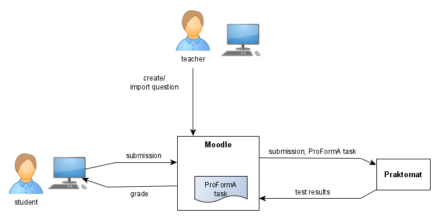
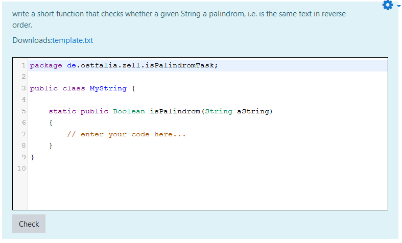
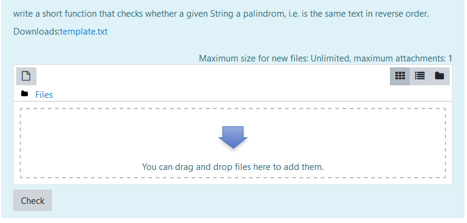
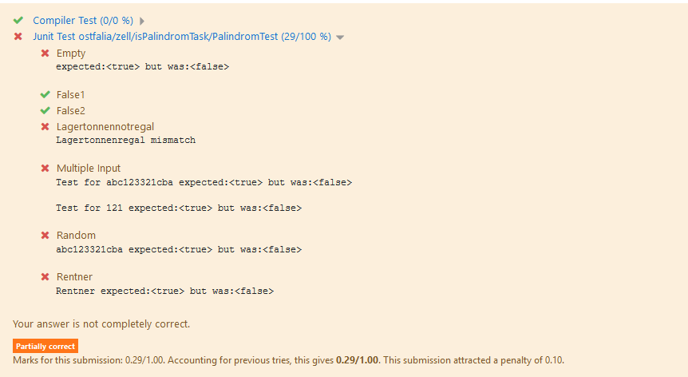
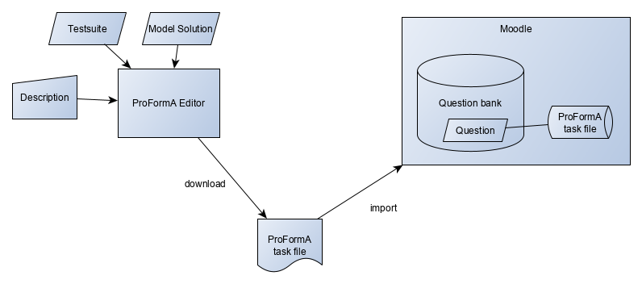
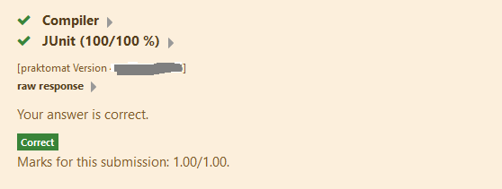

Requires at least Praktomat Version 4.7!!

The ProForma Moodle Question Type is a Moodle Plugin that is used for 
automatically grading programming questions in Moodle quizzes. Questions are 
internally stored in the ProFormA format (https://github.com/ProFormA/proformaxml). 

Tests are run on a back-end system (test runner) that also conforms to the 
ProFormA standard (https://github.com/ProFormA/proformaxml) version 2: Praktomat (https://github.com/elearning-ostfalia/Proforma-Praktomat).

Standard test frameworks are used for specifying tests. Currently the following programming languages and test frameworks are supported:

- Java: JUnit 4, JUnit 5, Checkstyle
- Python: Doctest
- Setlx: Test, Syntax Check

Any other  programming language resp. test framework can be used as long as Praktomat (or any other ProFormA compatible test runner used as back-end) supports it. Since all code is open source, it can be easily extended to other languages and frameworks.

The plugin comes with a built-in Java question form editor. Simple Java questions can be created diretly in Moodle with that editor. Simple means: only one file per JUnit test and only one Checkstyle test. More complex questions must be created outside of the system with a stand-alone editor (https://media.elan-ev.de/proforma/editor/releases.html) or by other means (e.g. script). These questions can be imported by use of another Moodle plugin. 

Copyright note: The renderer code partly bases upon the renderer from essay question type (Moodle core).
Small code parts (in particular in qbehaviour_adaptiveexternalgrading) are copied from Coderunner 
(https://moodle.org/plugins/qtype_coderunner).
  
## Features

- Java code can be checked with JUnit and Checkstyle
- various submission formats: 
    
    * editor with programming language support such as syntax highlighting or automatic indentation
    * file upload (for more than one file)
    * external repository (SVN in case of using Praktomat) 
- code snippet as starting point for student
- immediate feedback for students (optional) 
- supported programming languages are only limited by the available grader back-ends 

## Screenshots

Student view with editor input (code template and syntax highlighting): 

Alternative: File upload with filepicker for large files or if the response consists of more than one file:

Student feedback for Java question:

 

## Installation

####  Prerequisites 

The ProFormA question type requires:

- the Moodle plugin `qbehaviour_adaptiveexternalgrading`
(https://github.com/elearning-ostfalia/moodle-qbehaviour_adaptiveexternalgrading) for 
question engine adaptation and

- a ProFromA grading back-end to run the tests.  
`ProFormA-Praktomat` (https://github.com/elearning-ostfalia/Proforma-Praktomat) is recommended.

Currently only simple Java and SetlX (https://randoom.org/Software/SetlX/) questions can be created straight in Moodle. Note that SetlX is disabled by default.

For importing questions from an external source an import plugin is available (optional):   

- Moodle-Plugin `qformat_proforma` (import for ProFormA questions)

We have a separate Javascript editor for creating tasks (https://github.com/ProFormA/formatEditor). An online version is available at 
https://proforma.github.io/formatEditor/proformaEditor.html
       
Of course ProFormA tasks can be created by different other external tools as well.

In order to download all students' submissions for e.g. checking for plagiats 
the plugin `responsedownload` is avaliable (https://github.com/elearning-ostfalia/moodle-responsedownload).

<!-- Import process:

-->

## Settings

### Admin settings

At least the following settings must be made:  

* set grader URI to IP address and port number of your 'ProFormA-Praktomat server'

and for the built-in Java question generator: 

* set Java version
* set Checkstyle version
* set JUnit version

There is a simple test for the connection between Moodle and Praktomat in the settings page where the grader URI is set. If you press the `save changes` button the connection is checked and in case of an error the error message is displayed. 

### Sample

The following steps describe how you can create a simple Java question. You should always test your question by actually sending a correct submission to the grader. 

* Go to an existing course (or create one)
* Go to the question back
* press `Create a new question...`
* select `ProFormA Task`
* If a selection dialog is visible then select Java and press 'ok'
* Fill in: `Question name` =`Test Question`, `Question text` = `test`
* Go to `1. JUnit Test` and enter `Title` = `JUnit`
* Enter the following code into the JUnit Test editor: 
 
        import static org.junit.Assert.*;
        import org.junit.Test;

        public class PalindromTest {
        
            @Test
            public void testRentner() {
                assertEquals("Rentner", true, MyString.isPalindrom("Rentner"));
            }
        }        

* Set `Response filename` to `MyString.java`
* Press `Save Changes`
* Select `Edit` -> `Preview`
* Enter the follwing code into the editor:

        public class MyString {
            
            static public Boolean isPalindrom(String aString) 
            {
                String reverse = new StringBuilder(aString).reverse().toString();
                return (aString.equalsIgnoreCase(reverse));
            }
        }

Then you should see:

### Quiz settings

In order to display the grading feedback to the student you need to set the following 
options in your Moodle quiz:

* Question behaviour: `Adaptive` (with our without penalties) for displaying immediate feedback
  or `deferred feedback` if the student  shall not see any feedback 
* Review Options: `Specific Feedback` set to `on` for showing detailed grading results
* Review Options: opt out `Right Answer` if you do not want to show the model solution

