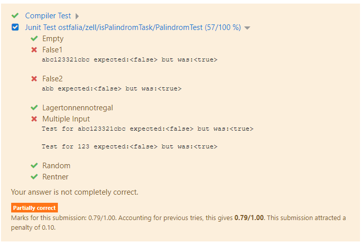

The ProForma Moodle Question Type is a Moodle Plugin that is used for 
automatically graded programming questions in Moodle quizzes.

Grading is performed by an external grading system that conforms to the ProFormA standard 
(https://github.com/ProFormA/proformaxml). 

Standard test frameworks (e.g. JUNIT for Java) are used for specifying tests. So there is no 
need to learn a new complex test description language.
 
The grading back-end detemines what programming languages can be used. The Moodle question type 
itself does not care about the programming language as far as there is support by the the grading back-end. 
It does not contain any code depending on a particular programming language 
(except for syntax highlighting).

  
Note: The renderer code partly bases upon the renderer from essay question type (Moodle core).
Small code parts (in particular in qbehaviour_adaptiveexternalgrading) are copied from Coderunner 
(https://moodle.org/plugins/qtype_coderunner).
  
## Features

- Moodle quiz question type 
- submission as file upload or as input into editor
- Submission file upload with more than one file 
- Syntax highlighting in editor
- Code snippet as starting point for student
- immediate feedback for students (optional) 
- supported programming languages are only limited by the available grader back-ends 

## Screenshots

Student view with editor input (code template and syntax highlighting): 

Alternative: File upload with filepicker for large files or if the response consists of more than one file:

Feedback from grader:

 

## Installation

Running this Plugin also requires the following plugins to be installed:

- Moodle-Plugin qbehaviour_adaptiveexternalgrading (question engine changes)
- Moodle-Plugin qformat_proforma (import for ProFormA questions)

Besides:
 
- A ProFromA grading back-end is required to run the tests. We use 
Ostfalia-Praktomat (https://github.com/elearning-ostfalia/Ostfalia-Praktomat) for testing 
Java code with JUnit.

- At the moment questions cannot be created directly in Moodle. 
Instead a ProFormA task must be created with an external tool and then imported into Moodle.   
We use a separate editor for creating those tasks (https://github.com/ProFormA/formatEditor). 
There is an online version available at 
https://media.elan-ev.de/proforma/editor/releases/3.0.1/proformaEditor.html.       
Of course ProFormA tasks can be created with from different other external tools.

## Settings

### Admin settings

* set grader URI to IP address and port number of your 'Ostfalia Praktomat server'

### Quiz settings

In order to show the grading feedback to the student you need to set the following options in your Moodle quiz:

* Question behaviour: 'Adaptive' (with our without penalties) for showing immediate feedback
  or 'deferred feedback' if the student  shall not see any feedback 
* Review Options: 'Specific Feedback' set to 'on' for showing detailed grading results
* Review Options: opt out 'Right Answer' if you do not want to show the model solution

